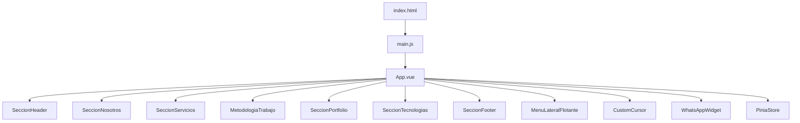

# Arquitectura del Proyecto Greenborn

## Resumen General
Greenborn es una aplicación web desarrollada con Vue 3, orientada a la presentación de servicios, portfolio y contacto para una empresa de software. Utiliza PrimeVue para componentes UI avanzados, Pinia para gestión de estado, y una estructura modular y escalable.

## Estructura de Carpetas

```
greenborn/
├── index.html                # Punto de entrada HTML
├── src/
│   ├── main.js               # Inicialización de la app Vue, registro de plugins y componentes globales
│   ├── App.vue               # Componente raíz, orquesta las secciones principales
│   ├── style.css             # Estilos globales
│   ├── assets/               # Recursos estáticos (imágenes, fuentes, SVG)
│   │   ├── img/              # Imágenes y logos
│   │   └── fnt/              # Fuentes personalizadas
│   ├── components/           # Componentes Vue
│   │   ├── genericos/        # Componentes reutilizables (ej: menú, efectos visuales)
│   │   └── ...               # Secciones principales (Header, Footer, Portfolio, etc.)
│   ├── stores/               # Gestión de estado global (Pinia)
│   └── ...
└── public/                   # Recursos públicos (imágenes, favicon)
```

## Componentes Principales
- **App.vue**: Orquesta la UI, importando y mostrando las secciones principales: Header, Nosotros, Servicios, Metodología, Portfolio, Tecnologías, Footer, menú lateral flotante, cursor personalizado y widget de WhatsApp.
- **Secciones**: Cada sección (ej: `SeccionHeader.vue`, `SeccionServicios.vue`, etc.) es un componente independiente, facilitando la escalabilidad y el mantenimiento.
- **Componentes Genéricos**: En `components/genericos/` se encuentran utilidades visuales y de interacción como menús, efectos de texto, diálogos de confirmación, etc.

## Gestión de Estado
- **Pinia**: Se utiliza para el manejo de estado global, centralizando datos como usuario, rutas, visibilidad de sidebar y gestión avanzada de modals (ventanas emergentes).
- **stores/app.js**: Define el store principal, con lógica para mostrar/ocultar modals, alertas y confirmaciones, y control de navegación lateral.

## Recursos y Estilos
- **assets/img/**: Contiene imágenes de branding, portfolio y redes sociales.
- **assets/fnt/**: Fuentes personalizadas para la identidad visual.
- **style.css**: Estilos globales, complementados por estilos scoped en cada componente.
- **Bootstrap 4**: Se utiliza para el layout y grillas, importado vía CDN en `index.html`.

## Dependencias Clave
- **Vue 3**: Framework principal.
- **PrimeVue**: Biblioteca de componentes UI avanzados.
- **Pinia**: Gestión de estado.
- **@greenborn/vue-custom-cursor**: Cursor personalizado.
- **@greenborn/vue3-whatsapp-widget**: Widget de WhatsApp para contacto directo.

## Navegación y Experiencia de Usuario
- **Menú Lateral Flotante**: Permite navegar entre secciones mediante scroll suave, resaltando la sección activa.
- **Responsive**: El diseño y los componentes están adaptados para dispositivos móviles y escritorio.
- **Footer**: Incluye enlaces a redes sociales y branding.

## Flujo de Inicialización
1. `index.html` define el punto de entrada y el contenedor `#app`.
2. `main.js` crea la app Vue, registra componentes globales, plugins y monta la app.
3. `App.vue` renderiza las secciones principales y utilidades globales.

## Diagrama de Alto Nivel


---

> Para detalles adicionales sobre cada componente, consultar los archivos fuente en `src/components/` y la lógica de estado en `src/stores/app.js`. 